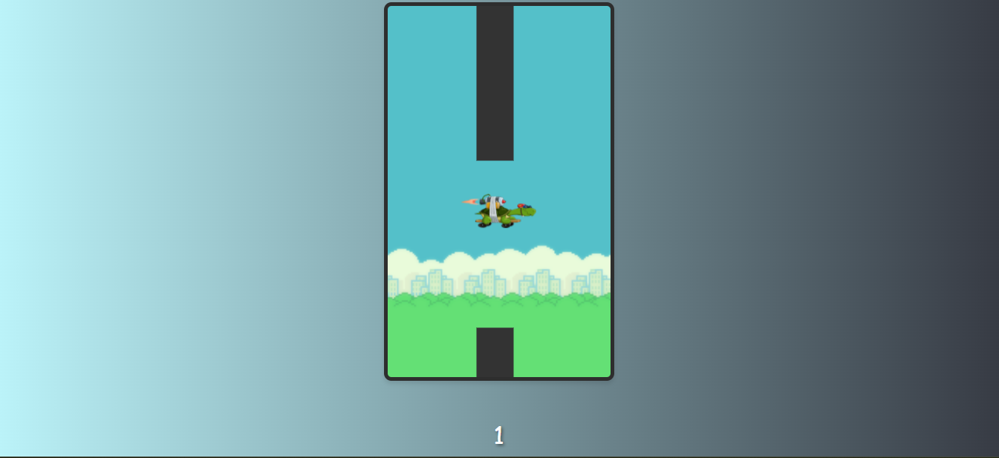

<h1 align="center"> Turtle Sk8. </h1>

Uma Tartaruga Voando em um Skate... É isso mesmo, você nao leu errado.  Então clique e jogue!

  <a href="#-tecnologias">Tecnologias</a>&nbsp;&nbsp;&nbsp;|&nbsp;&nbsp;&nbsp;
  <a href="#-projeto">Projeto</a>&nbsp;&nbsp;&nbsp;

 

  

## 🚀 Tecnologias

Esse projeto foi desenvolvido com as seguintes tecnologias:

- HTML e CSS
- JavaScript

## 💻 Projeto

Aplicação construída com base no jogo Flappy Bird, alterando o personagem em ação utilizando uma Tartaruga em seu Skate, maneiro nao?!  

## 🔖 Layout

Você pode visualizar o resultado clincando neste [LINK](https://kiqprado.github.io/Turtle-Fly/).

---

  
  &nbsp;&nbsp;&nbsp;|&nbsp;&nbsp;&nbsp;
  
 
